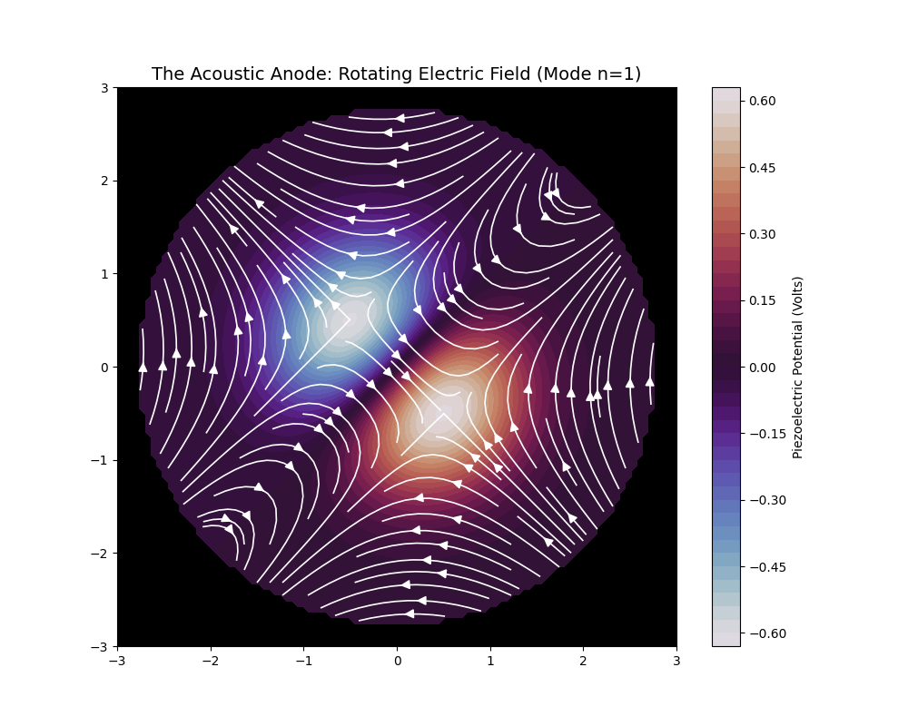
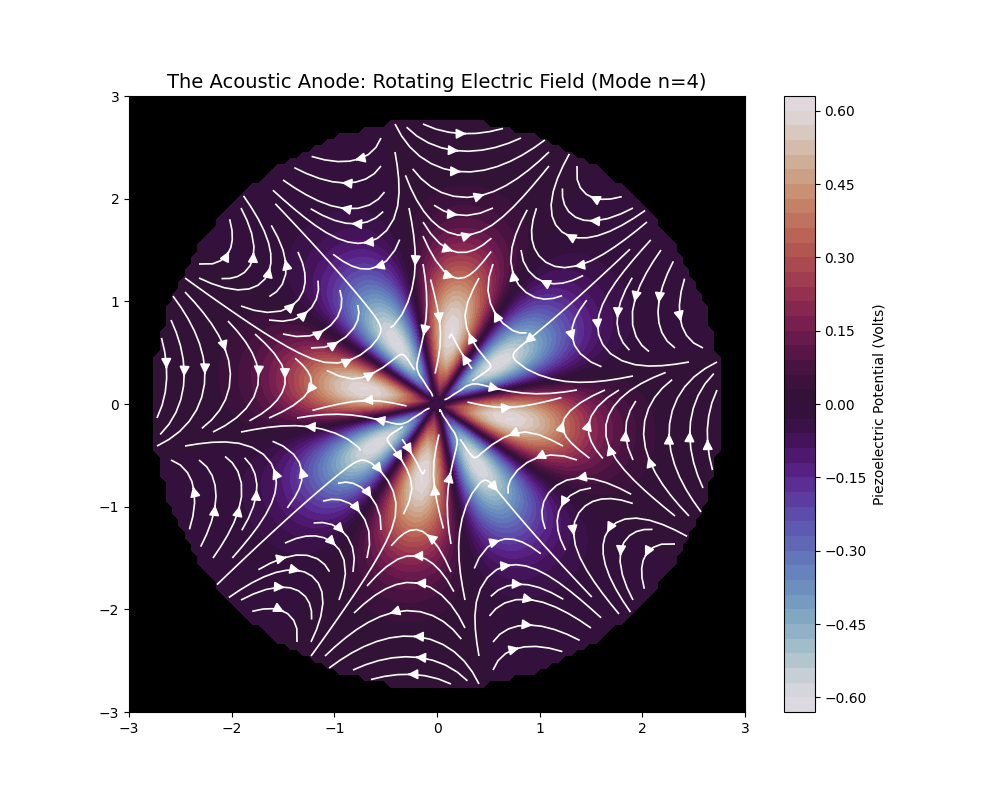

# Acoustic Torsion Driver (Solid State Vortex)

 

**Proof of Concept: Generating rotational electric fields via piezoelectric interference.**

> *"The hull is the engine."* — Solid State Propulsion Theory

## 🎵 The Concept
Standard electrogravitic engines require heavy mechanical rotation to create a vortex. This project proves that **Sound** can replace **Mechanics**. By interfering two acoustic standing waves at a 90° phase shift inside a piezoelectric medium, we generate a "Virtual Spin" (Traveling Potential Wave) that induces a rotational electric field without moving parts.

## 🔬 Key Findings

### 1. The Propulsion Mode (Harmonic n=1)
At the fundamental frequency, the interference pattern creates a high-torque dipole. The electric field spirals inwards, creating massive rotational force (Lift).

* *Topology:* Spiral / Vortex
* *Function:* Max Thrust / Lift

### 2. The Stabilization Mode (Harmonic n=4)
At the fourth harmonic, the field self-organizes into a "Magnetic Lotus." This multipole geometry locks the ether in place, providing stability and suspension.

* *Topology:* Closed Loop / Lattice
* *Function:* Hover / Gyroscopic Stabilization

## 📚 Documentation
For the mathematical proof of the traveling wave potential and piezoelectric conversion, see the [Full Research Paper](paper/acoustic_driver.pdf)
